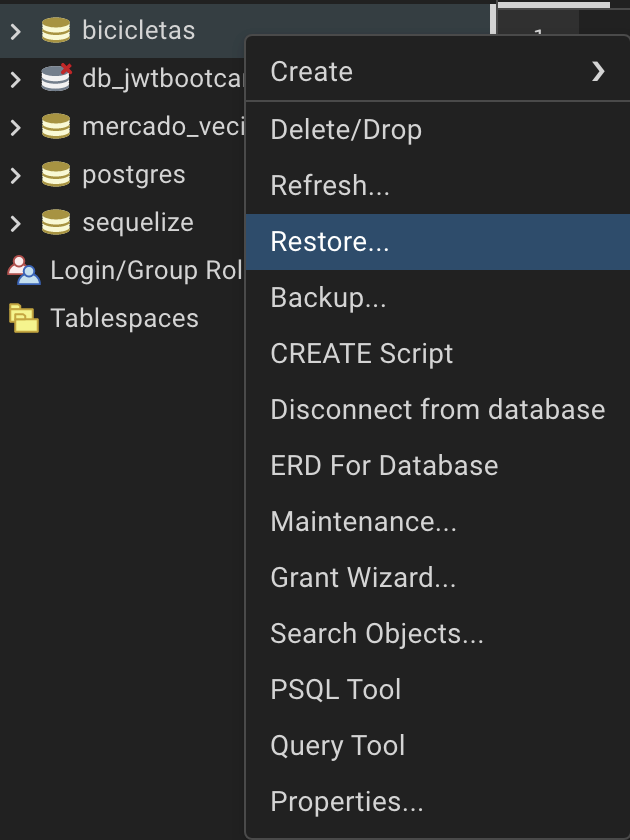
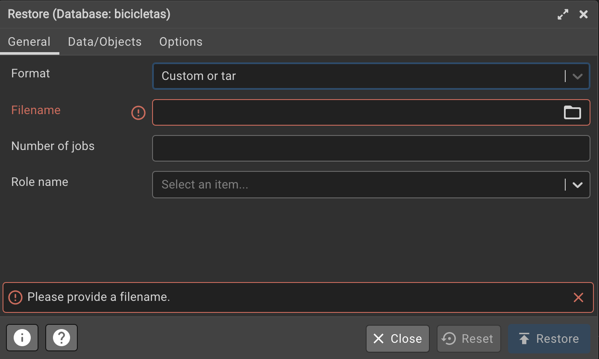

# Documentación

El proyecto esta realizado con:

1.- Node JS: Usando librerías como pg, express, bcrypt, jwt y axios

2.- React: Usando el motor de Vite, librerias como bootstrap-react y axios

## Organización

1.- En './reports.sql' podrá encontrar las solicitudes correspondientes a la primera sección del enunciado.

2.- El proyecto esta divido en dos carpetas, una de frontend para React y otra de backend para Express y Pg.

## Consideraciones

1.- Asegurarse de tener instalado el entorno de Node JS, en caso contrario instalarlo siguiendo la documentación oficial


2.- Deberá en segunda instancia crear la base de datos antes de ejecutar nuestros directorios.
````
Abrir una nueva terminal en su escritorio y ejecutar:

a) psql -U postgres

b) escribir la contraseña correspondiente a su usuario y ejecutar el siguiente comando:

c) CREATE DATABASE bicicletas;
``````

3.- Hacer restore de la configuracion de la base de datos proporcionado en las instrucciones de la prueba, en esta instancia se ocupo PgAdmin para poder hacer un restore con el archivo .backup.

a) Para aquello debe tener instalado [PgAdmin](https://www.pgadmin.org/download/)

b) Ya abierto PGAdmin e ingresar sus credenciales y como anteriormente creamos ya una base de datos, haremos click derecho en este, clickeando en Restore:



c) En este modal cargaremos el archivo de .backup ubicado en la carpeta recursosBD/backUpSales.


__Crearemos una tabla adicional__
````
Dirigete a './backend/src/database/createtable.sql' copia el codigo en la shell de posgtres o pgadmin
Esto creara la tabla de usuarios para poder registrar y loguearse.
``````

## Abrir en su IDE la carpeta correspondiente a este proyecto y abriremos dos nuevas terminales.

__En una ejecutamos:__
```
cd frontend
npm install
```

__En la segunda:__
``````
cd backend
npm install
Abrir './backend/.env' y configurar su clave, usuario de postgres, nombre de la base de datos, gmail y clave de gmail para nodemailer
``````

# Ejecutar en ambas terminales los procesos.
Asegurarse de ester posicionado en las carpeta correspondiente

__Frontend, esto levantará nuestra aplicación de React__
```
npm run dev
```

__Backend, esto levantará nuestro servidor de express__
```
npm run dev
```

Ya se estará ejecutando por completo, basta con dirigirse al link consologueado por la carpeta de frontend para ver el panel.


# Estructura Frontend

La carpeta de frontend esta estructurada de la siguiente forma:

a)'./frontend/src/App.jsx' Corresponde al archivo principal, donde se cargara en primera instancia la data solicitada con axios.

b)'./frontend/src/components/Menu.jsx' En Menu.jsx se encontrara la lógica que ejecuta los filtros y los maneja en la tabla segun sus estados.

c)'./frontend/src/components/Login.jsx' Componente que maneja el logueo mediante axios.

d)'./frontend/src/components/Register.jsx' Componente que maneja el registro mediante axios.

e)'./frontend/src/components/Navbar.jsx' Componente que maneja el navbar mediante eventos de estado.


# Estructura Backend

La carpeta de backend esta estructurada de la siguiente forma:

a)'./backend/app.js' Corresponde al archivo principal que ejecutará el servidor.

b)'./backend/src/database' Contiene la inicializacion y conexión a la base de datos usando pg.

c)'./backend/src/controllers' En ella las funciones necesarias para hacer solicitudes a la base de datos segun los requerimientos.

d)'./backend/src/routes' Las Rutas que ejecutarán los controladores.

e)'./backend/src/middleware' La configuracion del middleware con jwt.


# NodeMailer

Para hacer uso de los envios de correos usamos la libreria de NodeMailer, para poder usarla debes editar "EMAIL_PASSWORD" en el archivo .env, para poder conseguir esta contraseña sigue este [tutorial](https://www.youtube.com/watch?v=u3YIHs1Rx78)